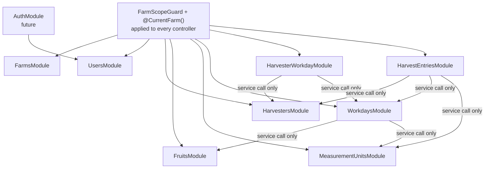
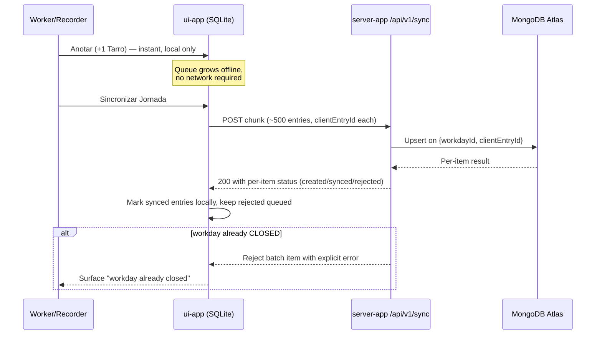

# System Architecture

> Companion visual: [arquitectura.html](arquitectura.html) — a standalone diagram page (open directly in a browser). This document is the reasoning behind those diagrams. See [modelo-datos.md](modelo-datos.md) for the data model these decisions build on top of.

## 1. Backend architecture: modular monolith, not microservices

`server-app` is one NestJS deployable — one process, one container, one deploy target. Internally it's organized into cohesive feature modules (the 8 entity modules already scaffolded — `farms`, `users`, `harvesters`, `fruits`, `measurementUnits`, `workdays`, `harvesterWorkday`, `harvestEntries` — plus a future `AuthModule`), but they all ship together and talk to each other in-process via NestJS dependency injection. No internal HTTP calls, no message queue between modules.

**Why not microservices**: single small team, MVP stage, no scale pressure yet, and no organizational boundary (no separate teams owning separate services) that a service split is supposed to reflect. More importantly: multi-tenant isolation via `farmId` (see [modelo-datos.md](modelo-datos.md#design-notes)) is already the hardest invariant this system has to hold — every query has to filter by it directly. Splitting into services multiplies the number of places that invariant can be forgotten (now it has to be enforced at every service boundary, not just every query) for zero benefit at this scale. A monolith keeps the enforcement surface as small as it can be.

**The seam that keeps a future split affordable — and the mistake to avoid now**: the current 8 modules all export raw `MongooseModule`:

```ts
// current pattern — every module does this
@Module({
  imports: [MongooseModule.forFeature([{ name: Farm.name, schema: FarmSchema }])],
  exports: [MongooseModule],
})
export class FarmsModule {}
```

That looks like a module boundary but isn't one: any future module that imports `FarmsModule` gets direct `@InjectModel(Farm.name)` access to the raw `farms` collection, which means it can query it directly — bypassing whatever scoping or business rules the owning module is supposed to enforce (active-flag checks, `farmId` scoping, etc.), and re-implementing (or forgetting) them at the call site instead.

**Convention going forward** (see also the `CLAUDE.md` note): once services get built on top of these schemas, each module exports its own `*Service` with purpose-built methods (e.g. `HarvestersService.findActiveByFarm(farmId)`), not `MongooseModule`. `forFeature` registration stays internal to the module. Cross-module logic goes through the owning service's public methods only. This is what actually makes a future extraction (if this ever needs to become two services) a localized change — the call sites are already service calls, so swapping in-process DI for an HTTP/queue client later doesn't ripple through the codebase.

**Tenant scoping is structural, not conventional**: rather than trusting every hand-written query to remember `.where({ farmId })`, tenant scoping is enforced once, centrally — a `FarmScopeGuard` (reads `farmId` off the authenticated JWT) + a `@CurrentFarm()` param decorator, applied to every controller. "Forgot to filter by farmId" becomes a missing-guard problem visible at the route level, not a bug buried inside a service method.

## 2. Client ↔ server communication

### Transport
REST over HTTPS, JSON bodies, DTO-validated (`class-validator`/`class-transformer`, per the DTO convention in `CLAUDE.md`). JWT bearer auth. Not GraphQL or gRPC — the traffic shape doesn't call for either: `ui-app` does one infrequent bulk "sync" call plus occasional catalog reads (fruits, units, harvester roster), not high-frequency or real-time traffic, and REST is the simplest fit for the `axios` client already in `ui-app`'s dependencies.

**API is versioned from the first real endpoint** (`/api/v1/...`). This matters more than usual here specifically because the client is a mobile app: app-store update lag means old binaries keep calling the API long after a new server version ships. The version boundary needs to exist from day one, not get retrofitted once it's already painful.

### Offline-sync design (the part that can't be hand-waved)

`ui-app` captures everything locally in SQLite the instant it happens (RNF-01, <100ms, zero network dependency) and only talks to the server when the user explicitly presses "Sincronizar Jornada." That means the sync endpoint has to handle everything a normal always-online API doesn't:

- **Idempotency.** Nothing in the current data model gives a `harvestEntries`/`harvesterWorkday` record a client-generated identity — `_id` is server-assigned, and `workdayNumber` is explicitly a local-only per-workday correlative, not a global id (see [modelo-datos.md](modelo-datos.md#harvesterworkday)). If a connection drops after the server commits but before the client sees the response, a naive retry creates a duplicate — a real double-count risk on numbers that determine what a harvester gets paid. **Decision**: add a client-generated `clientEntryId` (can just be the SQLite row's own id) to both collections, with a unique compound index server-side (`{ workdayId, clientEntryId }`), and make the sync endpoint upsert on conflict instead of blind-inserting.
- **Partial failure.** The sync response reports per-item status (created / already-synced / rejected+reason) rather than all-or-nothing — one bad row (e.g. a harvester soft-deleted after capture but before sync) shouldn't block or force an endless retry of an otherwise-good batch.
- **Closed-workday conflicts.** `workdays.status` can already be `CLOSED` with `finalTotalKg` frozen (RF-01.2) by the time a delayed or multi-device sync arrives. **Decision**: reject with a specific, client-surfaceable error ("this workday was already closed") — no silent reopen-and-recompute, no silent drop.
- **Batch size.** A farm with a week-long dead zone can queue thousands of rows. **Decision**: chunk sync uploads (~500 entries/request) rather than one unbounded POST — both Railway's and Render's default proxy layers have body-size/timeout ceilings that an unbounded single request risks hitting.
- **Token lifetime vs. offline stretches.** "Login online, use offline, token only re-checked at sync time" ([modelo-datos.md](modelo-datos.md#design-notes)) collides with a short-lived access token: a worker who hasn't synced in a week hits a 401 mid-harvest, and fixing it (full re-login) requires the connectivity they may not have right then. **Decision**: this has to be settled in the first `AuthModule` pass, not deferred — either a deliberately long-lived access token (low blast radius: a bearer token scoped to one farm) or a real refresh-token flow shipped from the start.

### Intra-backend communication
Plain NestJS provider injection between the 8 modules (see the seam note in §1) — no internal HTTP or queue at this stage.

## 3. Deployment & infrastructure

```
ui-app (Expo)                    server-app (NestJS, Docker)          MongoDB Atlas
  local SQLite  ── HTTPS/REST ──▶  modular monolith          ── TLS ──▶ (shared tier)
  (offline capture)   JWT          Railway or Render, always-on
```

- **`server-app` hosting**: containerized (`server-app/Dockerfile`, multi-stage: `deps` → `dev`/`build` → `prod-deps` → `runtime`, non-root user, `node:22-alpine`) and deployed to Railway or Render **on an always-on paid tier, not a sleep/free tier**. Sync traffic is bursty and infrequent — roughly once per farm per day — so a cold start (Render's free tier sleeps after ~15 min idle) would hit exactly when a user is relying on the one network-dependent moment in their workflow. That property matters more than the Railway-vs-Render brand comparison: the app itself is a plain Dockerfile service with no platform-specific code, so the platform choice is low-stakes and reversible — pick either paid always-on tier and move on.
- **Database**: MongoDB Atlas, shared/free tier to start. Network posture: "Access from Anywhere" (`0.0.0.0/0`) + Atlas's enforced TLS + a least-privilege (`readWrite`-scoped, not admin) DB user. This is a deliberate MVP tradeoff, not an oversight — Atlas PrivateLink needs an M10+ dedicated cluster, and neither Railway nor Render exposes a static egress IP on their base tiers, so a real IP allowlist isn't practical yet either.
- **Secrets**: PaaS-native secret manager (Railway/Render env vars), never committed (`.env` is already gitignored). Explicit rule: local `docker-compose` dev credentials must never be reused as production values — an easy copy-paste mistake under solo-dev time pressure.
- **CI**: GitHub Actions running lint + build + test on every PR. Labeled honestly: there's essentially no real test coverage yet beyond the Nest scaffold's spec file, so this pipeline is scaffolding that grows meaningful as services/controllers land — not proof of coverage today.
- **CD**: the PaaS's native GitHub push-to-deploy on merge to `main` — no hand-rolled deploy pipeline needed at this scale.
- **`ui-app` distribution**: Expo EAS Build (native Android/iOS binaries) + EAS Update (OTA JS updates). Not configured yet (no `eas.json`, no `extra.eas.projectId` in `app.json`) — a future step, not blocking current work. The API-versioning decision above exists precisely because of this split: an OTA update can ship a JS/API-contract-compatible change instantly, but a SQLite-schema or native-module change needs a full app-store release with its own rollout lag.
- **CORS**: `ui-app` already has a web target (`react-native-web`, `expo start --web` in `package.json`) — don't assume CORS is irrelevant just because the primary client is native mobile; configure it explicitly once the web target is actually used for anything (testing, a future admin surface).

## 4. Security posture

- `nationalId` (worker PII) should be excluded from default query projections the same way `passwordHash` already is on `users` (`select: false` / explicit DTO projection) — roster/list endpoints get hit far more often than single-record detail views, so this is where an accidental leak is most likely.
- Password hashing library: `argon2` (or `bcrypt` as the boring-safe fallback) — needs to be picked before `AuthModule` work starts; nothing is installed yet.
- Rate limiting on `/auth/login` (`@nestjs/throttler`) — cheap, meaningfully reduces credential-stuffing exposure on a system holding PII across many tenants.
- Health-check endpoint (`/health`, `@nestjs/terminus` + a Mongo ping) — both Railway and Render gate deploy/restart decisions on one; without it, a broken deploy can be marked healthy.

## 5. Known gaps (stated honestly — not solved by this document)

- **`Decimal128` JSON serialization**: `unitCount`, `totalKg`, `finalTotalKg`, `kgFactor` are `Decimal128` in the schema (correct — see [modelo-datos.md](modelo-datos.md), avoids float drift on season totals) but Mongoose returns BSON `Decimal128` objects. Without an explicit `@Transform` on response DTOs, the mobile client receives `{"$numberDecimal": "12.34"}` instead of a plain value. This will surface as a real bug the first time a response DTO gets built, not before.
- **No migration/schema-evolution tool** decided (e.g. `migrate-mongo`) — worth deciding before real data exists, since the `clientEntryId` addition above is itself a schema change that will need to run against whatever data exists by then.
- **No Mongo connection resilience** configured (`serverSelectionTimeoutMS`/retry options) in `DatabaseModule` — relevant given PaaS cold starts and Atlas shared-tier pauses.
- **No CI** actually running the `Dockerfile` build yet (see §3) — it's proven to build and boot locally (both the `runtime` target against real Atlas, and the `dev` target via `docker-compose`), but nothing in the repo enforces that on every PR.

## Diagrams

### System / deployment

```mermaid
flowchart LR
    subgraph Client["ui-app (Expo)"]
        SQLite[(Local SQLite)]
        Sync[Sync trigger:\n"Sincronizar Jornada"]
    end

    subgraph Backend["server-app — NestJS modular monolith (Docker)"]
        API["REST API /api/v1\nJWT auth + FarmScopeGuard"]
        Modules["8 feature modules\n(DI, no internal HTTP)"]
    end

    Atlas[(MongoDB Atlas\nshared tier)]

    SQLite --> Sync
    Sync -- "HTTPS batch upload\n(chunked, idempotent)" --> API
    API --> Modules
    Modules -- TLS --> Atlas

    GH[GitHub Actions CI] -. lint/build/test on PR .-> Repo[(repo)]
    Repo -. push-to-deploy on merge to main .-> Backend
    EAS[EAS Build / EAS Update] -. native binary / OTA .-> Client
```

### Backend module boundaries



### Offline-sync sequence


