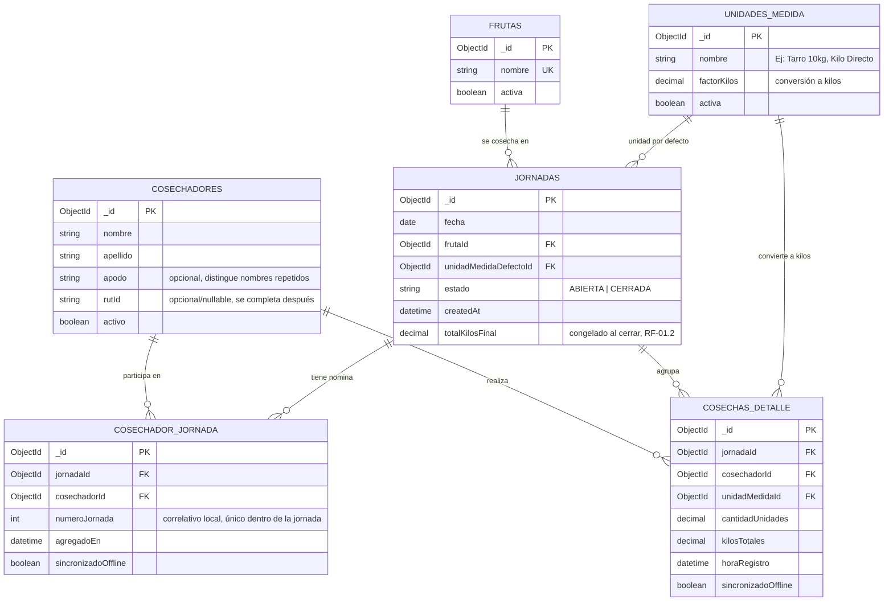

# Modelo de Datos — Diagrama de Entidades

> Refleja el modelo Mongo/Mongoose definido en `CLAUDE.md` (que reemplaza la propuesta SQL relacional de [REQUIREMENTS.md](../REQUIREMENTS.md) §4). La integridad referencial (`frutaId`, `cosechadorId`, `unidadMedidaId`) se valida en la capa de aplicación (`server-app`), no en la base de datos.

## Diagrama entidad-relación

**Índices únicos en `cosechadorJornada`**: `{ jornadaId, numeroJornada }` (nunca dos personas con el mismo número el mismo día) y `{ jornadaId, cosechadorId }` (un cosechador no puede estar dos veces en la nómina de la misma jornada).

**Nota de normalización**: `cosechasDetalle` sigue referenciando `cosechadorId`+`jornadaId` directamente (no vía `cosechadorJornada._id`) a propósito, para evitar una indirección extra en el hot path de escritura local (RNF-01, <100ms). Que solo pueda existir un detalle si ya existe nómina se valida en la capa de aplicación, igual que el resto de la integridad referencial de este modelo.

## Definición de entidades

### `cosechadores`
Representa a un **trabajador de campo** (temporero/a) que cosecha fruta y cuya producción se registra día a día. Es el catálogo global y persistente de personas, necesario para acumular historial entre jornadas. El campo `activo` permite dar de baja a un cosechador (fin de temporada, término de contrato) sin borrar su historial de cosechas ya registradas.

`nombre`+`apellido` **no es una clave única**: dos cosechadores distintos pueden llamarse igual legítimamente (la identidad real es el `_id`). `rutId` es opcional/nullable porque en terreno solo se pide nombre y apellido al registrar rápido — se puede completar después por un admin. `apodo` es opcional y existe específicamente para ayudar a distinguir nombres repetidos (ej. "Juan Perez (Chico)") cuando un anotador sin memoria del historial tiene que elegir entre coincidencias al agregar a alguien a una jornada.

Cuando el sistema encuentra 2+ cosechadores con el mismo nombre al buscar, la desambiguación es un problema humano, no algorítmico: se le muestra al anotador el contexto disponible (apodo, RUT si existe, meses/jornadas trabajadas) para que decida junto con el propio trabajador, o cree un registro nuevo si no hay forma de confirmar. Ante la duda, crear un registro de más es preferible a fusionar mal — un falso negativo se corrige después con una fusión admin (pendiente de construir), mientras que un falso positivo corrompe el historial de dos personas distintas. Por eso ningún código debe asumir que `cosechadorId` es inmutable para siempre en los registros históricos.

### `frutas`
El **catálogo de productos/cultivos** que se pueden cosechar (Limón, Naranja, Palta, etc.). Es puramente configuración de negocio: se administra en runtime y no debe requerir cambios de código para agregar una fruta nueva (RF-03.3). Cada jornada se abre asociada a una única fruta, ya que en terreno un día de cosecha típicamente se dedica a un solo producto.

### `unidadesMedida`
El **catálogo de envases o formas de medición** con su equivalencia a kilos (Tarro 10kg, Saco 20kg, Canasto 15kg, o "Kilo Directo" para pesaje en balanza). `factorKilos` es la conversión que permite que el sistema calcule automáticamente los kilos totales a partir de la cantidad de envases anotados. Una unidad con `factorKilos = 1` representa el modo de **pesaje directo** (RF-03.2), donde lo que se ingresa ya es el peso en kilos. Al igual que `frutas`, es configurable sin tocar código (RF-03.1).

### `jornadas`
Representa **un día de cosecha**: la unidad de trabajo que el anotador abre al empezar el turno (RF-01.1), fijando la fruta y el envase/unidad por defecto que se usarán salvo que un registro puntual indique otro. Su `estado` (`ABIERTA`/`CERRADA`) controla si todavía se pueden anotar entregas o si el día ya fue cerrado y sus totales quedaron congelados (RF-01.2). Es el contenedor que agrupa todos los `cosechasDetalle` de ese día.

### `cosechadorJornada`
Es la **nómina/roster del día**: qué cosechadores (del catálogo global) participan en una jornada específica, independiente de si ya tienen alguna entrega anotada. Resuelve RF-02.1 (listar a los cosechadores activos del día) porque alguien puede aparecer en la lista del anotador con 0 anotaciones apenas se agrega, sin necesidad de que exista todavía un `cosechasDetalle`. Permite sacar a alguien de la lista del día (se agregó por error) sin tocar su catálogo ni su historial de otras jornadas.

`numeroJornada` es el correlativo (1, 2, 3...) que el anotador usa para identificar rápido a cada cosechador *dentro de esa jornada* — pensado para listas de 20 a 40 personas donde buscar por nombre es más lento que decir un número corto. Se calcula 100% en el dispositivo (máximo de los números ya asignados en esa jornada + 1) porque una jornada normalmente la lleva un solo dispositivo/anotador: no requiere coordinación con el servidor ni con otros dispositivos, cumpliendo el requisito de <100ms sin depender de red (a diferencia de un número global persistente, que sí necesitaría un contador atómico en el servidor y dejaría sin número a los cosechadores creados offline hasta el primer sync). Es único dentro de la jornada, no global, y nunca se recicla dentro del mismo día aunque alguien se saque de la lista a medio turno.

### `cosechasDetalle`
Es **cada anotación individual de entrega**: el equivalente digital de una raya en el cuaderno de papel. Registra que un cosechador determinado entregó cierta cantidad de unidades (o kilos, en modo pesaje directo) de fruta, en qué momento, y con qué unidad de medida. `sincronizadoOffline` indica si ese registro ya viajó desde el dispositivo local (SQLite) hacia el servidor. Es la entidad de mayor volumen del sistema: cada toque de "+1" en el anotador genera (o incrementa) un registro de este tipo.

## Relaciones

| Relación | Cardinalidad | Descripción |
|---|---|---|
| `cosechadores` → `cosechadorJornada` | 1 : N | Un cosechador del catálogo puede aparecer en la nómina de muchas jornadas distintas a lo largo del tiempo. |
| `jornadas` → `cosechadorJornada` | 1 : N | Una jornada tiene una nómina con muchos cosechadores participando ese día. |
| `cosechadores` → `cosechasDetalle` | 1 : N | Un cosechador acumula muchos registros de entrega a lo largo de sus jornadas. |
| `frutas` → `jornadas` | 1 : N | Una fruta puede ser cosechada en muchas jornadas distintas (distintos días). |
| `unidadesMedida` → `jornadas` | 1 : N | Una unidad de medida puede ser la unidad "por defecto" de muchas jornadas. |
| `unidadesMedida` → `cosechasDetalle` | 1 : N | Cada registro de detalle usa una unidad de medida (puede diferir de la unidad por defecto de la jornada — soporta cambiar de envase a mitad de jornada). |
| `jornadas` → `cosechasDetalle` | 1 : N | Una jornada agrupa todos los registros de cosecha del día; se elimina en cascada si se borra la jornada. |

## Notas de diseño

- **`cosechasDetalle.unidadMedidaId` es independiente de `jornadas.unidadMedidaDefectoId`**: el envase por defecto solo pre-rellena el formulario de anotación; cada registro individual puede usar una unidad distinta (RF-03.2, modo pesaje directo vs. conteo de envases dentro de la misma jornada).
- **Sin `ON DELETE CASCADE` real**: a diferencia del DDL SQL original, Mongo no impone esto — si se elimina una `jornada`, `server-app` debe borrar/archivar sus `cosechasDetalle` explícitamente en la capa de servicio.
- **Cierre de jornada (RF-01.2)**: al pasar `estado` de `ABIERTA` a `CERRADA`, los totales agregados (kilos totales, unidades por cosechador) deben calcularse una vez y congelarse en el propio documento `jornadas`, en vez de recalcularse con `aggregate()` en cada lectura.
- **`sincronizadoOffline`**: existe en el documento del servidor como espejo del flag equivalente en la tabla SQLite local de `ui-app`; en el servidor siempre llega en `true` (solo se sincronizan registros ya subidos), pero se conserva el campo para trazabilidad y para futuras necesidades de auditoría/reconciliación.
- **Catálogos (`frutas`, `unidadesMedida`) nunca hardcodeados**: son colecciones editables en runtime, sin relación con el código de `server-app` (RF-03.1, RF-03.3).
- **Fusión de cosechadores duplicados (futuro)**: si el flujo "crear nuevo ante la duda" genera con el tiempo dos entradas de catálogo que en realidad son la misma persona, hará falta una herramienta admin que reasigne `cosechadorId` en `cosechadorJornada` y `cosechasDetalle` históricos. No está construida todavía, pero el modelo la anticipa (ver nota en `cosechadores` arriba).

## Pendiente / fuera de alcance de este diagrama

- Modelo del store local SQLite en `ui-app` (aún no implementado) — cuando exista, debería documentarse aparte ya que puede incluir columnas de sincronización adicionales (ej. `dirty`, `syncedAt`, cola de reintentos) que no tienen equivalente 1:1 en el modelo Mongo del servidor.
- Autenticación/usuarios del sistema (anotador, admin) — no está definida aún en `CLAUDE.md` ni en `REQUIREMENTS.md`.
