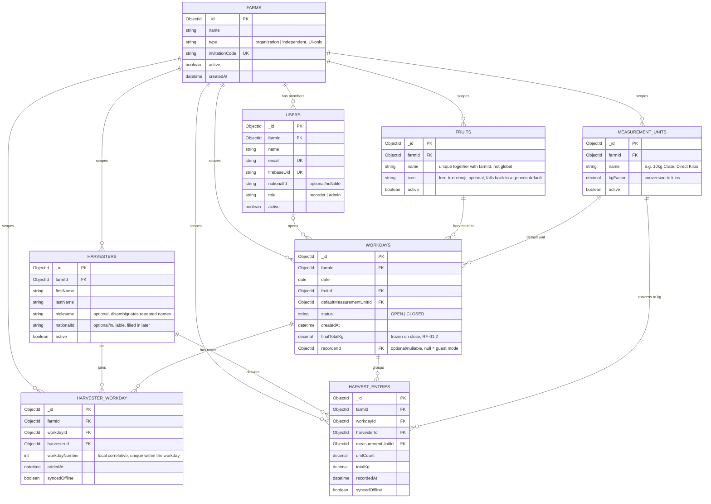

# Data Model — Entity Diagram

> Reflects the Mongo/Mongoose model defined in `CLAUDE.md`. Entity and field names are in English (code-level convention); this does **not** apply to `ui-app`'s field-facing copy, which stays in Spanish per RNF-02 (the vocabulary field workers actually use — "Anotar", "Tarro", "Vuelta" — is what appears on screen, regardless of how the underlying model is named). Referential integrity (`fruitId`, `harvesterId`, `measurementUnitId`, etc.) is validated at the application layer (`server-app`), not by the database.

## Entity-relationship diagram

**Unique indexes on `harvesterWorkday`**: `{ workdayId, workdayNumber }` (no two people share the same number on the same day) and `{ workdayId, harvesterId }` (a harvester can't appear twice in the same workday's roster).

**Normalization note**: `harvestEntries` still references `harvesterId`+`workdayId` directly (not via `harvesterWorkday._id`) on purpose, to avoid an extra indirection in the local write hot path (RNF-01, <100ms). That a delivery entry can only exist if a roster entry already exists is validated at the application layer, same as the rest of this model's referential integrity.

## Entity definitions

### `farms`
The **tenant**: the agricultural operation/farm the harvest is being tracked for. Everything else in the model — users, harvesters, catalogs, workdays — belongs to exactly one farm, and a farm can never see or reuse another farm's data.

No `adminId` field: who administers a farm is derived from `users` where `farmId` matches and `role: 'admin'` — same pattern as the rest of the model (relate via FK, not an embedded reverse pointer). This also leaves room for a farm to have more than one admin later without a schema change. `invitationCode` is what a `recorder` enters during onboarding to join an existing farm — regenerable by an admin at any time (overwriting the field invalidates the old code instantly). `type` (`organization` | `independent`) is UI-only (whether to show the "invite your team" step after creation); it doesn't change any backend logic.

Every user always has a `farmId` — "working independently" simply creates a single-member farm (`type: 'independent'`), nobody is ever left without one. This is different from why `workdays.recorderId` can be null: one is attribution (who recorded it), the other is data isolation (whose data is this) — leaving `farmId` null anywhere would open the door to two "farm-less" users seeing each other's data.

### `users`
The **recorder** (or an admin) who uses `ui-app`: authentication is delegated to **Firebase Authentication** — `ui-app` logs in directly against Firebase's client SDK (not against `server-app`), and `server-app` never sees or stores a password, only verifies the resulting Firebase ID token via `firebase-admin`. `farmId`/`role` travel as custom claims on that token. `firebaseUid` is the link from this document back to the corresponding Firebase user. That session is then persisted locally on the device — the token is only needed at sync time (RF-04.3), never for local capture (RNF-01). This lets "being logged in" keep working offline indefinitely: the initial login (which does require connectivity) only happens once per device, and the Firebase SDK refreshes the token in the background afterward, which reinforces this argument rather than weakening it.

`workdays.recorderId` is **optional/nullable**: the app also supports a no-account guest mode, so field registration is never blocked. A workday with no `recorderId` simply stays unattributed until that recorder logs in — analogous to how `harvesters` tolerates creating new records when in doubt (see note below): here too, not blocking the field workflow takes priority over having perfect attribution from the first moment.

`farmId` is **required, never null** — assigned during onboarding (see below) and determines which `farms` all the data this user creates or sees belongs to.

`nationalId` is **optional/nullable**, same reasoning as on `harvesters`: not asked for at signup, can be filled in later (e.g. for an admin who needs it on record for legal/payroll purposes).

`role` distinguishes `recorder` from `admin` (for tasks like filling in `nationalId` on `harvesters` or reviewing closed workdays), though the specific permissions of each role aren't defined yet.

### `harvesters`
Represents a **field worker** who harvests fruit and whose output is recorded day by day. It's the persistent catalog of people **for a farm** (`farmId`), needed to accumulate history across workdays within that farm. The `active` field lets a harvester be deactivated (end of season, contract ended) without deleting their history of already-recorded harvests.

Scoped by `farmId` on purpose: `firstName`, `lastName`, and `nationalId` are personal data, and a recorder at one farm shouldn't be able to see or add another, unrelated farm's workers to their workday. Accepted trade-off: if the same physical person works at two different farms, each one registers them separately, with no shared history between them — if that's ever needed, it would be an explicit manual merge, not something automatic.

`firstName`+`lastName` is **not a unique key**: within the same farm, two different harvesters can legitimately share a name (the real identity is the `_id`). `nationalId` is optional/nullable because in the field, only first and last name are asked for at quick registration — it can be filled in later by an admin. `nickname` is optional and exists specifically to help disambiguate repeated names (e.g. "John Smith (Shorty)") when a recorder with no memory of the history has to pick between matches when adding someone to a workday.

When the system finds 2+ harvesters with the same name while searching, disambiguation is a human problem, not an algorithmic one: the recorder is shown the available context (nickname, national ID if it exists, months/workdays worked) so they can decide together with the worker, or create a new record if there's no way to confirm. When in doubt, creating one extra record is safer than merging incorrectly — a false negative gets fixed later with an admin merge (not built yet), while a false positive corrupts two different people's history. That's why no code should assume `harvesterId` is immutable forever in historical records.

### `fruits`
The **catalog of crops/products** a farm can harvest (Lemon, Orange, Avocado, etc.), owned by each `farmId` — two different farms can each have their own "Lemon" with no conflict (the unique index on `name` is compound `{ farmId, name }`, not global). It's pure business configuration: each farm manages it at runtime and it must never require code changes to add a new fruit (RF-03.3). Every workday is opened tied to a single fruit, since in the field a harvest day is typically dedicated to one product.

### `measurementUnits`
A farm's **catalog of containers or measurement methods**, with their kilo equivalence (10kg Crate, 20kg Sack, 15kg Basket, or "Direct Kilos" for scale weighing), owned by each `farmId` for the same reason as `fruits`. `kgFactor` is the conversion that lets the system automatically calculate total kilos from the number of containers recorded. A unit with `kgFactor = 1` represents **direct-weighing mode** (RF-03.2), where the entered value is already the weight in kilos. Like `fruits`, it's configurable without touching code (RF-03.1).

### `workdays`
Represents **one day of harvest**: the unit of work a recorder opens at the start of a shift (RF-01.1), fixing the fruit and default container/unit used unless a specific entry says otherwise. Its `status` (`OPEN`/`CLOSED`) controls whether deliveries can still be recorded or whether the day has already closed and its totals are frozen (RF-01.2). It's the container that groups all of a day's `harvestEntries`.

### `harvesterWorkday`
The day's **roster**: which harvesters (from the farm's catalog) are participating in a specific workday, independent of whether they already have a delivery recorded. Solves RF-02.1 (list the day's active harvesters) because someone can appear on the recorder's screen with 0 entries as soon as they're added, with no need for a `harvestEntries` record to exist yet. Lets someone be removed from the day's list (added by mistake) without touching their catalog entry or their history from other workdays.

`workdayNumber` is the correlative (1, 2, 3...) the recorder uses to quickly identify each harvester *within that workday* — meant for lists of 20 to 40 people, where searching by name is slower than saying a short number. It's computed 100% on the device (the max of the numbers already assigned in that workday + 1) because a workday is normally run from a single device/recorder: it needs no coordination with the server or other devices, meeting the <100ms requirement with zero network dependency (unlike a persistent global number, which would need an atomic counter on the server and would leave harvesters created offline without a number until the first sync). It's unique within the workday, not global, and is never recycled within the same day even if someone is removed from the list mid-shift.

### `harvestEntries`
Each **individual delivery entry**: the digital equivalent of a tally mark on the paper notebook. Records that a given harvester delivered a certain number of units (or kilos, in direct-weighing mode) of fruit, at what time, and with which measurement unit. `syncedOffline` indicates whether that record has already traveled from the local device (SQLite) to the server. It's the highest-volume entity in the system: every "+1" tap on the recorder screen creates (or increments) a record of this type.

## Onboarding: how `farmId` gets assigned

Role first, then affiliation:

1. **Are you a recorder or an administrator?**
2. **If administrator** — two visible options, same backend action (create `farms` + `users.role='admin'`), differing in `type` and the following screen:
   - *"Create a farm for my team"* → `type: 'organization'`, asks for a name, then shows the `invitationCode` with an "invite your team" step.
   - *"Work independently"* → `type: 'independent'`, asks for a name too (avoids a generic name if someone is invited later), no invitation screen.
3. **If recorder** — asks for the invitation code, validates it against `farms.invitationCode` (with `active: true`), creates `users` with `role: 'recorder'` and the `farmId` of the farm found. There's no "independent recorder" mode: someone working alone needs admin-level permissions over their own catalog (fruits/units/harvesters), so that case always falls under the administrator branch.

Changing farms or roles after creation doesn't require any schema change (they're mutable fields on `users`), but **it's not retroactive**: workdays/records already created under the previous `farmId` keep that `farmId` forever — the same philosophy already used for never reassigning `harvesterId` except via an explicit manual merge.

## Relationships

| Relationship | Cardinality | Description |
|---|---|---|
| `farms` → `users` | 1 : N | A farm has one or more users (recorders and/or admins); every user belongs to exactly one farm. |
| `farms` → `harvesters` | 1 : N | The harvester catalog is owned by each farm. |
| `farms` → `fruits` | 1 : N | The fruit catalog is owned by each farm. |
| `farms` → `measurementUnits` | 1 : N | The measurement unit catalog is owned by each farm. |
| `farms` → `workdays` | 1 : N | Every workday belongs to exactly one farm, whether opened by a logged-in user or in guest mode. |
| `farms` → `harvesterWorkday` | 1 : N | Denormalized from the workday — see design note below. |
| `farms` → `harvestEntries` | 1 : N | Denormalized from the workday — see design note below. |
| `users` → `workdays` | 0..1 : N | A user can open many workdays over time; a workday has at most one recorder (or none, if it's a guest workday). |
| `harvesters` → `harvesterWorkday` | 1 : N | A catalog harvester can appear in many different workdays' rosters over time. |
| `workdays` → `harvesterWorkday` | 1 : N | A workday has a roster with many harvesters participating that day. |
| `harvesters` → `harvestEntries` | 1 : N | A harvester accumulates many delivery records across their workdays. |
| `fruits` → `workdays` | 1 : N | A fruit can be harvested across many different workdays (different days). |
| `measurementUnits` → `workdays` | 1 : N | A measurement unit can be the "default" unit for many workdays. |
| `measurementUnits` → `harvestEntries` | 1 : N | Each entry uses a measurement unit (which can differ from the workday's default unit — supports switching containers mid-workday). |
| `workdays` → `harvestEntries` | 1 : N | A workday groups all of that day's harvest records; deleted in cascade if the workday is deleted. |

## Design notes

- **`harvestEntries.measurementUnitId` is independent of `workdays.defaultMeasurementUnitId`**: the default unit only pre-fills the entry form; each individual record can use a different unit (RF-03.2, direct-weighing vs. container-counting within the same workday).
- **No real `ON DELETE CASCADE`**: unlike the original SQL DDL, Mongo doesn't enforce this — if a `workday` is deleted, `server-app` must explicitly delete/archive its `harvestEntries` at the service layer.
- **Closing a workday (RF-01.2)**: when `status` moves from `OPEN` to `CLOSED`, aggregate totals (total kilos, units per harvester) should be computed once and frozen into the `workdays` document itself, instead of being recomputed with `aggregate()` on every read.
- **`syncedOffline`**: exists on the server document as a mirror of the equivalent flag in `ui-app`'s local SQLite table; on the server it always arrives as `true` (only already-uploaded records get synced), but the field is kept for traceability and future auditing/reconciliation needs.
- **Catalogs (`fruits`, `measurementUnits`) are never hardcoded**: they're runtime-editable collections, unrelated to `server-app`'s code (RF-03.1, RF-03.3).
- **Duplicate-harvester merging (future)**: if the "create new when in doubt" flow eventually produces two catalog entries that are actually the same person, an admin tool will be needed to reassign `harvesterId` across historical `harvesterWorkday` and `harvestEntries` records. Not built yet, but the model anticipates it (see the note under `harvesters` above).
- **Login online, use offline**: the expected flow is login → session persisted locally (token) → everything else works without network, including opening new workdays. The server only validates the token at sync `POST` time; never before.
- **Guest mode still has a farm**: `workdays.recorderId` being null is a valid, supported state (not an error case), but it does **not** mean "no farm" — `workdays.farmId` is set regardless, taken from the device session's active farm at the moment the workday is opened, independent of whether there's a `recorderId` or not. Confusing these two would be the same kind of hole already avoided once with `recorderId`.
- **`farmId` is denormalized across all 7 collections, not just derived via join**: if `workdays.farmId` depended on `recorderId → users.farmId`, a guest workday (`recorderId: null`) would have no way to resolve its farm. Storing `farmId` directly on every collection also avoids every `server-app` query needing a `$lookup` to filter by tenant — a classic source of cross-tenant data leaks if a query forgets the join — and matches the criterion the model already used in `harvestEntries` (denormalizing `harvesterId`+`workdayId` to avoid an extra lookup in the local hot path). In `harvesterWorkday` and `harvestEntries`, `farmId` is copied from the same value the workday already holds in memory at the moment of recording — costs nothing on the hot path.

## Pending / out of scope for this diagram

- Local SQLite store model in `ui-app` (not implemented yet) — once it exists, it should be documented separately since it may include additional sync columns (e.g. `dirty`, `syncedAt`, retry queue) with no 1:1 equivalent in the server's Mongo model.
- ~~Concrete token mechanism (access JWT + refresh, expiration times, where the refresh token is stored in `ui-app`)~~ — **resolved**: authentication moved to Firebase Authentication (see `users` above). `ui-app` authenticates directly against Firebase's client SDK, which owns token issuance/refresh/local storage; `server-app` only verifies the ID token via `firebase-admin` at sync time. `users.firebaseUid` is the resulting link field.
- Role-specific permissions (what an `admin` can do that a `recorder` can't) — only the field exists, not the authorization logic.
- Whether several devices can share the same workday (today it's assumed one device per workday, see the `workdayNumber` note).
- Multi-admin per farm — the schema already allows it implicitly (several `users` with the same `farmId` and `role: 'admin'`), but the invite/manage UI for it doesn't exist.
- A user belonging to more than one farm at a time — today `users.farmId` is singular.
- Transferring administration of a farm to another user.
- Company → many-farms hierarchy — if needed later, this would be solved by adding a `companies` collection above `farms`, without reworking anything in the collections that already depend on `farmId`.
- Expiration and usage auditing of `invitationCode` — today it's a fixed, non-expiring code; a code shared once could circulate indefinitely until an admin manually regenerates it.
- Reclaiming a guest workday (`recorderId: null`) later and assigning it to a real user — if built, it must preserve the workday's original `farmId` (the device's farm at the time of recording), never replace it with whoever is claiming it's current farm.
